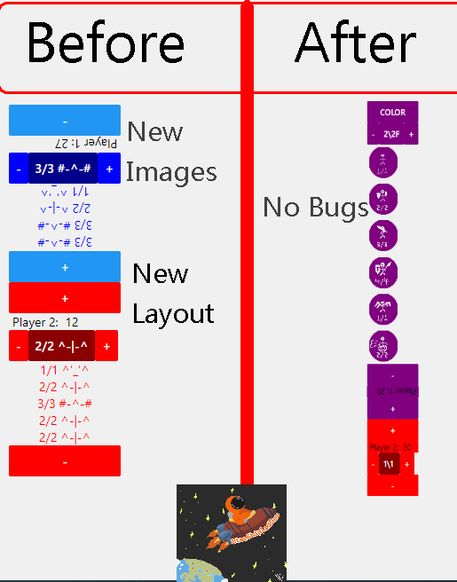

# MTG_Health_App_2021_React_Native



## Notes/Know Bugs:

> *No Breaking Bugs Known Of As Yet*

> No Scroll feature means there can be a maximum of 6 minion tokens on an average android screen


## Features(Planned In Brackets)

(Scrollable Interface)
(Multiple Players)
Select Several Types Of Tokens/Minions
Set Minions To Be 'Tapped' Or Not
Change Player & Minion Colors
Custom App Icon File

## View of progress

### Inital React Native Build


## Latest Build

*dd/mm/yyyy - build number - Build Title*

*Image of the latest build.*

## Latest Update Notes:

```

26/12/2021{

	"Title":"Inital Upload",
	"Summary":"Create the Main Class Componenet, Add Inital Image Files, Update Icons",
	"HealthCounter":{
		"Backend Logic":["Update refrences of minion index to be the index rather than index-1. This is due to no longer needing a workaround where (index) would be false if index was 0 due to javascript stuff"],
		"Frontend Display":[
		"Add color objects to state as strings. Modify componenet's color style to refrence this instead of being hard-coded. This is to allow modular coloring",
		"Move Minion Componenets below health componenets to allow for cleaner UX "]
	},
	"images":{
		"ImageFiles":["Add 50x50 image .pngs to be displayed via 'HealthCounter.js's 'Image' componenets, to allow nice UI with images"]
	}
	
}

```

## Latest Updates

*26/12/2021 Inital Upload - Base Program Uploaded*


## Next Build

01/03/2021  **No Delays As Of Yet**

* Add Scrolling So That Unlimited Tokens Can Be Displayed


## Skill developing

I planned on this project improving my skills in the following:

> React Native Development For All-In-One Mobile Development

> Node.js async calls to network files

> Small-scale Pixel Art For Small Devices

> User Excperience And Usability

## Installing and Compiling:

*Insert need-to-knows about installing*

*Insert links to installation files*

*Insert installation instructions*

## Usage - How To

*Touch Minion* - 'Greys' / 'Ungreys' minion to represent being 'tapped'

*Hold Minion* - Removes minion from player's team

*Press 'Color'* - Changes Player Color

*Plus/Minus Buttons By MinionType* - Changes What Type Of Minion Will Be Added When The Minion Button Is Pressed


Developed by Starshiplad 

[Twitter](https://twitter.com/StarshipladDevp) 

[Discord](https://discord.gg/jAqfVpmqdA)

